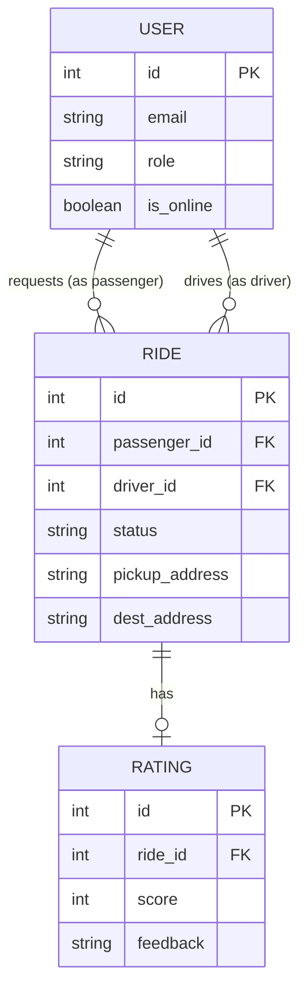

# Design Document: Real-Time Campus Mobility Platform

## 1. Problem Understanding
Modern campus environments frequently suffer from uncoordinated and informal transportation systems. Specifically, at large campuses, users struggle to find last-mile transportation efficiently, while drivers lack visibility into ride demand. This project addresses these inefficiencies by building a centralized, real-time platform that allows passengers to discover, request, and manage rides seamlessly.

The core challenge involves managing live location data, real-time state synchronization, and robust concurrent workflows, ensuring a ride can only be assigned to a single driver while keeping all parties updated instantly.

## 2. System Architecture
The application employs a monolithic client-server architecture tailored for rapid real-time performance:

- **Client Tier:** A Single Page Application (SPA) built with HTML5, Vanilla JavaScript, and CSS3. It communicates with the backend via REST APIs for transactional data and WebSockets for real-time events.
- **Server Tier:** A Python-based backend using the FastAPI framework. FastAPI provides native, high-performance asynchronous execution, which is crucial for handling multiple concurrent WebSocket connections efficiently.
- **Data Tier:** SQLite database utilizing SQLAlchemy ORM to manage relational data, structured to be completely self-contained and configuration-free for seamless local execution.

## 3. Database Schema
The database uses three primary tables: `users`, `rides`, and `ratings`.

- **Users:**
  - `id` (Integer, Primary Key)
  - `email` (String, Unique)
  - `hashed_password` (String)
  - `name` (String)
  - `role` (String: 'passenger' or 'driver')
  - `vehicle_info` (String, Nullable)
  - `is_online` (Boolean)
  - `current_lat`, `current_lng` (Float, Nullable)

- **Rides:**
  - `id` (Integer, Primary Key)
  - `passenger_id` (Integer, Foreign Key -> users.id)
  - `driver_id` (Integer, Foreign Key -> users.id, Nullable)
  - `pickup_lat`, `pickup_lng` (Float)
  - `pickup_address` (String)
  - `dest_lat`, `dest_lng` (Float)
  - `dest_address` (String)
  - `status` (String: 'Requested', 'Accepted', 'In Progress', 'Completed', 'Cancelled')
  - `created_at`, `updated_at` (DateTime)

- **Ratings:**
  - `id` (Integer, Primary Key)
  - `ride_id` (Integer, Foreign Key -> rides.id)
  - `score` (Integer)
  - `feedback` (String, Nullable)

## 4. Entity Relationship Diagram (ERD)

## 5. API Overview

### RESTful Endpoints
- `POST /api/auth/register`: Register a new user (passenger or driver).
- `POST /api/auth/login`: Authenticate and receive a JWT.
- `GET /api/auth/me`: Retrieve current user profile.
- `POST /api/rides`: (Passenger) Request a new ride.
- `GET /api/rides`: Fetch relevant rides (all past rides for passenger, active ones for drivers).
- `PUT /api/rides/{id}`: Update ride status (e.g., Driver accepts ride, marks complete).
- `PUT /api/drivers/availability`: (Driver) Toggle online/offline status.

### WebSocket Events (`/ws`)
- **Server to Client (`NEW_RIDE_REQUEST`)**: Broadcasts to online drivers when a passenger requests a ride.
- **Server to Client (`RIDE_UPDATED`)**: Broadcasts state changes (Accepted, In Progress, Completed) to the involved passenger and driver.

## 6. Design Decisions
1. **Python/FastAPI over Node.js:** Due to environmental constraints (`npm` unavailable), FastAPI was chosen. It equals Node.js in asynchronous capabilities for WebSockets while offering built-in data validation via Pydantic.
2. **Vanilla Frontend Stack:** To maximize performance and prevent dependency bloat, a zero-build vanilla JS/CSS approach was adopted. Glassmorphism UI provides the required rich aesthetic.
3. **SQLite vs MongoDB:** SQLite was chosen for its zero-configuration portability, fulfilling the requirement for a fully reproducible GitHub repository (Deliverable 3).
4. **JWT Authentication:** Chosen over session-based auth to ensure a stateless backend, which scales better if the system is moved to a distributed architecture.
